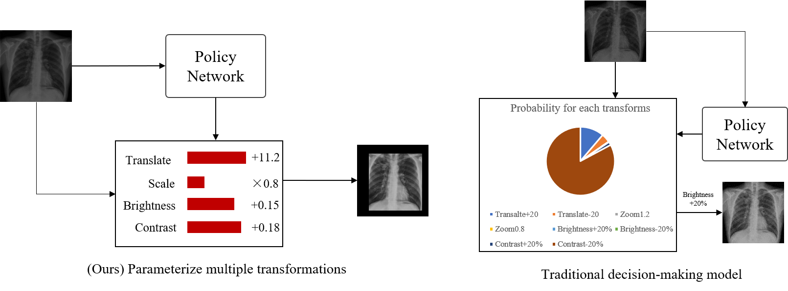

# GrETTA: Gradient-Estimation Test-Time data Augmentation

*Yuanbiao Wang, Jiancheng Yang, Zudi Lin*


**If you have any questions about this project, contact me via wangyuanbiao2016@gmail.com**



## Usage

### Environment

Please install the latest version of the following software & packages

```
Python3
PyTorch
torchvision
kornia
efficientnet_pytorch
```

### Pretrained weights

In our experiments, we need pre-trained weights for ResNeXT and WideResNet trained on CIFAR-100

We provide the model weights for these large conv nets, as well as distillated smaller student model, which will be handy for gradient estimation. You can download them via **Google Drive**.

- [[ResNeXT]](https://drive.google.com/file/d/13WhxEVrh23cV22URtAuJytBgG2cvgP0h/view?usp=sharing)
- [[WideResNet]](https://drive.google.com/file/d/19fHZG4ZVcli0L8nmXCdf8YZvu6wHwHFx/view?usp=sharing)
- [[ResNeXT_student]](https://drive.google.com/file/d/1MQs0Vx4Mjv6w5Rs5Qnr31YrLy6xTNMJj/view?usp=sharing)
- [[WideResNet_student]](https://drive.google.com/file/d/1ycNtxRtewRs81myG6Hn3YI9ds2aufM_p/view?usp=sharing)

### Dataset

We are using CIFAR100 and the corrupted version CIFAR100-C to test robustness. You can download the CIFAR100-C dataset via [[Google Drive]](https://drive.google.com/drive/folders/1PPJ-7yPJB1sEj4LUVH7sFw9G8iQkzTW6?usp=sharing)

The original version should be automatically handled by `torchvision`

### Training

Designate the arguments in `utils.py`, in the function `default_arg`

The original arguments are 

```json
{
    'model': 'resnext',
    'augmix': True,
    'opt': 'adam',
    'lr': 1e-6,
    'init': 'zero',
    'epochs': 2,
    'reg': 'none',
    'policy': 'resnet18',
    'sigmoid': False,
    'est': 'vanilla',
    'transform': 'geometry',
    'num_samples': 12,
    'paths': {
        'wideresnet': 'model/model_wrn_best.pth.tar',
        'resnext': 'model/model_resnext_best.pth.tar'
    },
    'student_paths': {
        'wideresnet': 'model/wrn_student_augmix.pth',
        'resnext': 'model/resnext_student_augmix.pth'
    },
    'checkpoints': 'checkpoints',
    'cifar': 'cifar',
    'cifarc': 'cifar_corrupt/CIFAR-100-C'
}
```

Under the main directory, run

```bash
python3 train.py
```


## Result

1. Experiments on Modified MNIST

   

   

   **Visualization**

   

2. Experiments on CIFAR100-C robustness benchmark

   **ResNeXT as classification model**

   

   **WideResNet as classification model**

   

   **visualization**

   


3. ChestXRay100 to CheXpert transfer learning test

   


